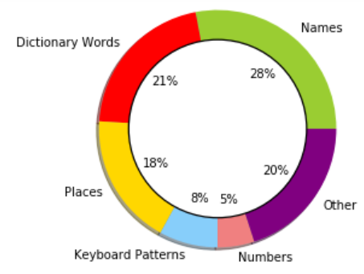
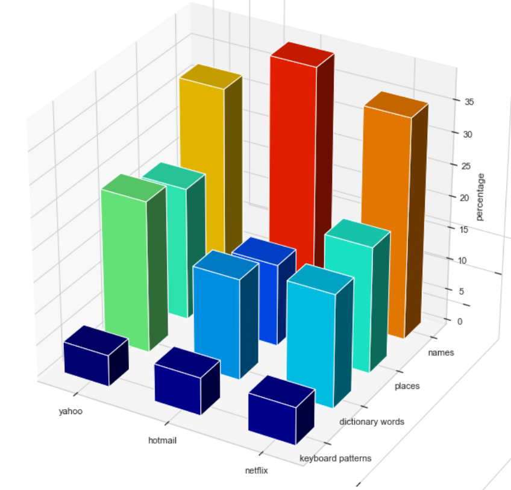
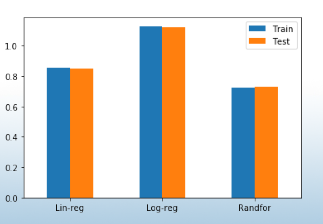
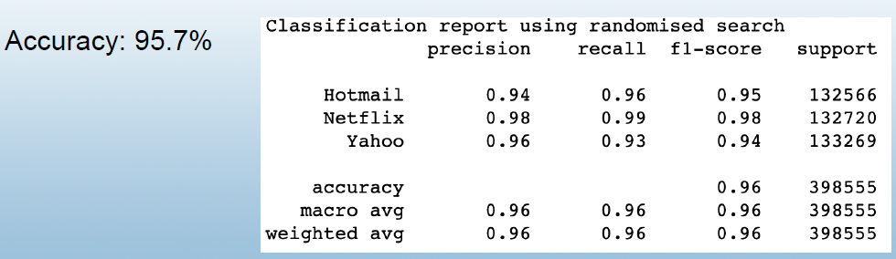

Password Analysis and Modeling

EECS731-Final-Project by: Yousif, Sahithi, Mugdha, Amin, Arman

Introduction:
In this project we do some exploratory data anaylysis and modeling for real world user passwords. The passwords were obtained from data leaks to yahoo, hotmail and netflix that happended in the past. The total number of passwords in our dataset was 454482 password. We identified the password sources that are in our password dataset and then we compared the password sources among different datasets. We then developed some features and added them to our dataframe and then we defined a score from 1-5 and added it to the dataset.

Agenda:

1. Exploratory Data Analysis and Visualization
Below is a diagram showing the datasources in the entire dataset.

Below is a comparison of the password sources for the different datasets: yahoo, hotmail and netflix.

2. Feature Engineering
We added the following features to our dataframe:
* Length, Has_upper, has_Special, has_number
* Upper_count, lower_count, numeric_count
* alphabet_count, specialchar_count
* Password Source (yahoo, hotmailand Netflix)

3. Modeling:

  3.1. Regression
  We did some regression analysis in order to predict the password score given the other attributes as features.
How good are models in predicting the relation between the features we generated and the target/independent variable “SCORE” of a password?
We used linear regression, logistic regression and random forest and below is a comparison between the mean squared error for the different models.

  3.2. Classification
For classification we tried to classify the passwords based on their source (hotmail, netflix or yahoo). We used random forest and support vector machine for building our classification models. 
Below is a result for using the random forest classifier trying to find the source of the password:

We also tried to classify passwords based on their strength (Weak, Medium or Strong).

  3.3. Clustering

4. Limitation and Challenges

5. Conclusion

